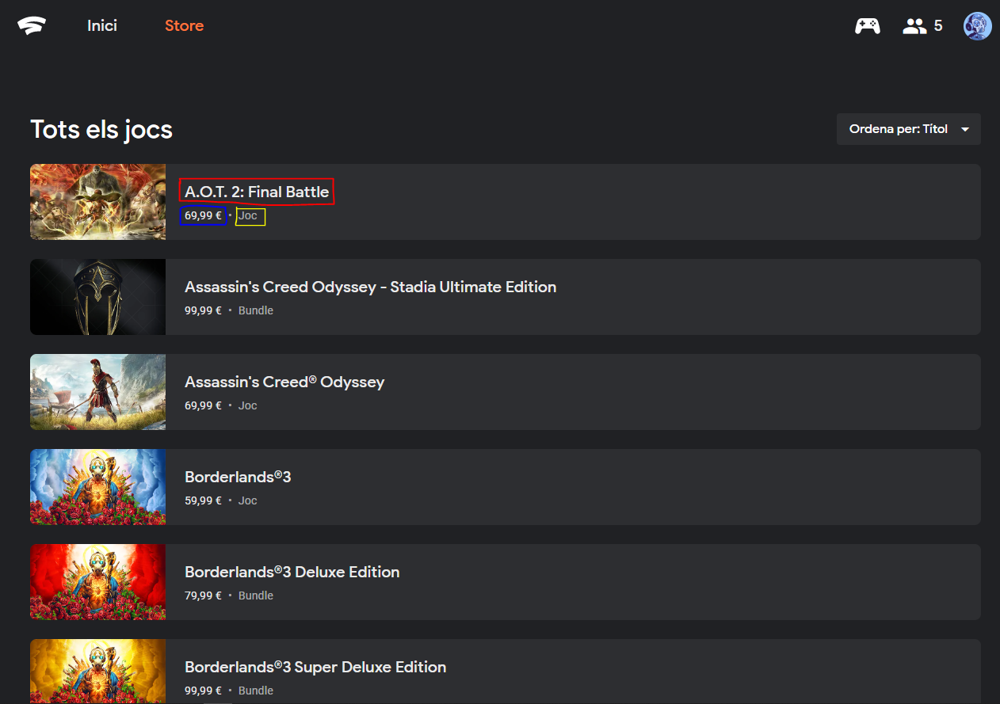
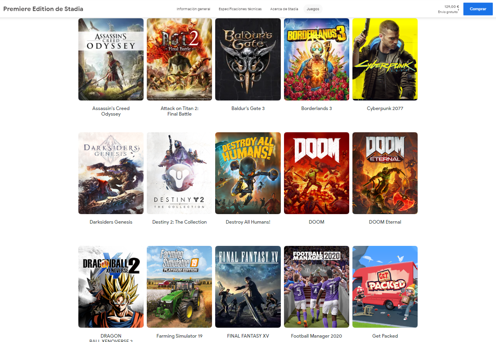

*****

# 1. Context
### Explicar en quin context s'ha recol·lectat la informació. Explicar per què el lloc web triat proporciona aquesta informació.

S’ha decidit fer aquesta pràctica de Web Scraping sobre Stadia, una nova plataforma de videojocs en streaming de Google.

La idea d’agafar aquesta plataforma de videojocs va néixer en veure que no existia cap lloc web on informes sobre l’evolució dels preus dels jocs dins d’aquesta plataforma, cosa que seria interessant per veure si en el moment de comprar un joc és una bona oferta o no. Ni la mateixa empresa de Google dona aquesta informació en obert (sense estar registrat), ni mitjançant la seva API. Suposem que en tractar-se d’una plataforma bastant nova, no han implementat encara aquesta API.

A part de fer un seguiment dels preus dels jocs, també es interessant poder extreure el llistat complet dels jocs que ja hi han a la plataforma i els que estan confirmats que vindran en un futur. En l’àmbit dels videojocs hi han moltes preguntes sobre la plataforma i quins jocs són els que hi han. En tractar-se d’una plataforma tancada als subscriptors “PRO”, els usuaris normals només es poden informar d’un llistat de jocs que hi ha a la web oficial de Stadia, però hem vist que no son tots els que hi han actualment dins la plataforma. Això ho hem pogut saber perquè un dels membres de l’equip té accés a la plataforma desde dins, cosa que volem aprofitar per extreure la informació dels jocs existents i fer un dataset amb aquesta informació.

Fins al dia 8 d’Abril de 2020, era una plataforma tancada als subscriptors de pagament, on només els primers inscrits, al mes de novembre, tenien accés. Ara mateix, s’ha obert aquest servei per a tothom amb un compte de Google. Pel que es pot utilitzar qualsevol compte per fer funcionar el script de scraping creat.

Per tant, en una primera fase ens hem marcat l’objectiu de:

* Obtenir un llistat amb tots el jocs disponibles i futurs, obtenint la informació de pàgines webs oficials.
* Anar a buscar dades sobre aquests videojocs a altres webs per complementar la informació disponible i donar més valor al dataset. Dades com la puntuació a altres plataformes i dates de llançament.

# 2. Definir un títol pel dataset
### Triar un títol que sigui descriptiu.

**Stadia Games Info**

Es tracta d’un llistat, on cada registre es un videojoc, o complement, i s’amplia amb els atributs que donen informació sobre aquest videojoc.

# 3. Descripció del dataset
### Desenvolupar una descripció breu del conjunt de dades que s'ha extret (és necessari que aquesta descripció tingui sentit amb el títol triat).

Aquest dataset conté dades de tres fonts:

* **Dades de obertes de la web [https://store.google.com/es/product/stadia_games] {https://store.google.com/es/product/stadia_games}**: Les dades d'aquesta font contenen els títols dels videojocs de la plataforma Stadia disponibles ara o en el futur.

* **Puntuacions dels jocs per a altres plataformes**: Per a cada joc de la plataforma Stadia, s'ha buscat la puntuació de revistes especialitzades i dels usuaris per a les plataformes PC, PlayStation 4 i XboxOne. Les dades s'han extret de la pàgina Metacritic.

* **Preu dels jocs a la plataforma Stadia**: Aquestes dades s'han extret de la pàgina de la plataforma Stadia. Per a accedir a aquestes dades, s'ha d'estar registrat a la plataforma.

# 4. Representació gràfica
### Presentar una imatge o esquema que identifiqui el dataset visualment

La primera imatge es una captura de la web interna de Stadia on pots comprar els videojocs. Es pot observar que d’aquesta web podem obtenir el títol, preu i tipus de joc:

La segona web on anar a buscar informació és la pàgina on pots inscriure’t a la plataforma. En una de les pestanyes de la web pots veure un llistat de jocs que anuncien: [https://store.google.com/es/product/stadia_games](https://store.google.com/es/product/stadia_games)

# 5. Contingut
### Explicar els camps que inclou el dataset, el període de temps de les dades i com s'ha recollit.

# 6. Agraïments
### Presentar el propietari del conjunt de dades. És necessari incloure cites de recerca o anàlisis anteriors (si n'hi ha).

# 7. Inspiració
### Explicar per què és interessant aquest conjunt de dades i quines preguntes es pretenen respondre.

Existeixen webs semblants, que extreuen un llistat dels jocs disponibles a la plataforma. Però, aquests portals estan mantinguts a mà pel seu creador i no informen sobre el preu dels jocs:

* Stadia Game DB ---> [https://stadiagamedb.com/](https://stadiagamedb.com/)
* The Stadia DB ----> [thestadiadb.com](thestadiadb.com)

La idea d’aquesta pràctica es poder tenir un script automatic que obtingui tota aquesta informació en el moment d’executar-lo.

Una de les utilitats que pot tenir aquest script és la de extreure la informació diariament, programant aquest script perque s’executi un cop al dia. D’aquesta manera es podria fer un seguiment dels preus dels videojocs a nivell individual i poder arribar a fer les visualitzacions oportunes sobre aquesta informació.

# 8. Llicència
### Seleccionar una d'aquestes llicències pel dataset resultant i explicar el motiu de la seva selecció:

Per aquest conjunt de dades hem escollit una llicència de Cultura Lliure: ***Reconeixement-CompartirIgual 4.0 Internacional de Creative Commons***

* **BY:** Amb aquest tipus de llicència es dóna llibertat per copiar, reproduir o modificar el codi, sempre que es reconegui l’autoria del projecte original, per donar valor a la feina feta en aquesta pràctica.
* **SA:** També afegim que els projectes derivats d’aquests, es comparteixin de la mateixa manera, per evitar que un producte derivat d’aquest tingui una llicència que prohibeixi l’ús comercial, limitant així les possibilitats de qualsevol persona que vulgui desenvolupar

# 9. Codi
### Adjuntar el codi amb el qual s'ha generat el dataset, preferiblement en Python o, alternativament, en R.

El codi es troba en la carpeta "src" a l'arrel del repositori de github [https://github.com/KRLSMolina/ScrapingStadia].

El codi continut a 

# 10. Dataset
### Publicar el dataset en format CSV a Zenodo amb una xicoteta descripció.

# 11. Lliurar
### Presentar el treball amb el DOI del dataset a Github

Tota la informació es pot trobar al repository de Github: [https://github.com/KRLSMolina/ScrapingStadia](https://github.com/KRLSMolina/ScrapingStadia)